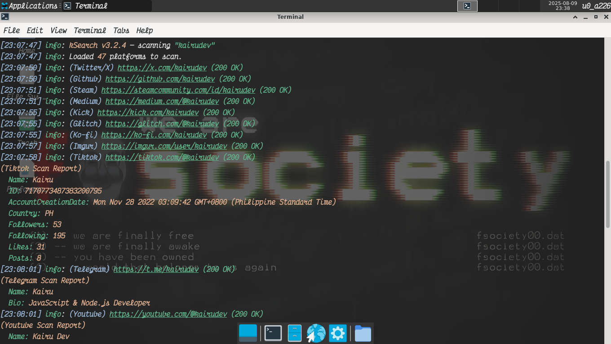
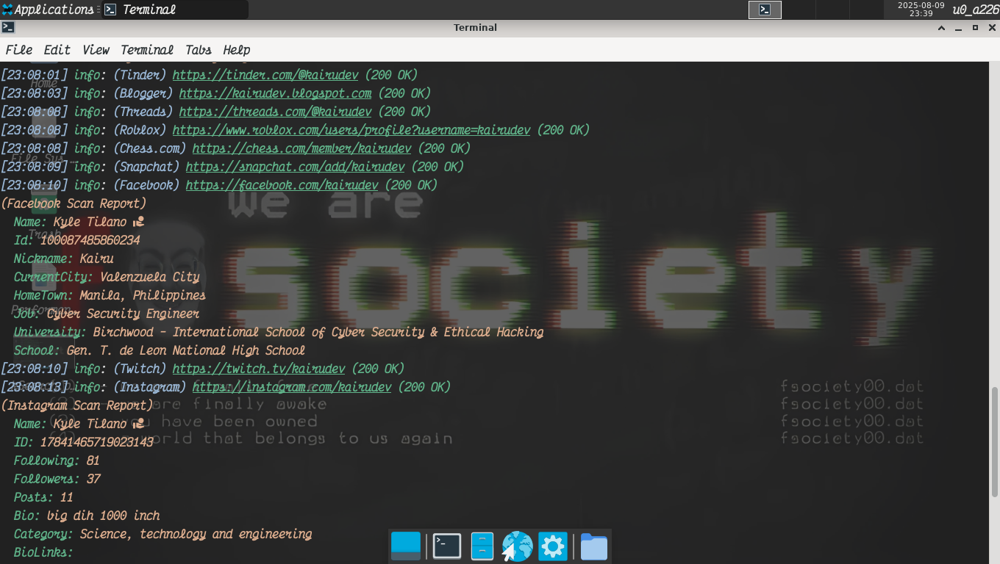

# kSearchProject

An open-source **OSINT** (Open-Source Intelligence) tool that searches for username profiles across multiple social media platforms.
Designed for ethical hacking, cybersecurity research, and digital investigations.




---

## Installation

```bash
git clone https://github.com/kyletechie/kSearchProject.git
cd kSearchProject 
npm install 
npm link
```

---

## 🚀 Usage

```text
Usage: kSearch [options]

An open-source OSINT tool to search for username profiles
across multiple platforms.

Options:
  -V, --version                             output the version number
  -u, --username <username>                 The username you want to search for (required).
  -t, --timeout <ms>                        Set how long (in milliseconds) to wait for each request before skipping. (default: 0 = wait forever)
  -o, --output <dir>                        Folder to save the scan results to. (default: "/data/data/com.termux/files/home/kSearchProject/results")
  -of, --output-format <json|csv|yaml|txt>  Choose the file format to save your results in. (formats: json, csv, yaml, txt). (default: "json")
  -v, --verbose                             Show detailed logs of what the tool is doing, including each HTTP request.
  --update                                  Update kSearch to the latest version.
  -h, --help                                display help for command

Developed by Kyle (@kyletechie) for ethical hacking and OSINT research purposes only.
This project was built entirely on an Android device using Termux.

If you'd like to support the development and help me get a laptop, consider donating:
https://www.paypal.me/KyleTilano
Thank you!
```

**Basic command:**

```bash
kSearch -u <username>
```

---

## Disclaimer

> This tool is intended for **ethical** use only.
> You are responsible for your actions. Do not use kSearch for illegal activities.

---

## Support

If you'd like to support development and help me get a laptop, you can donate here:
[PayPal — Kyle Tilano](https://www.paypal.me/KyleTilano)

---

## License

This project is licensed under the **MIT License** — see the [LICENSE](./LICENSE) file for details.
